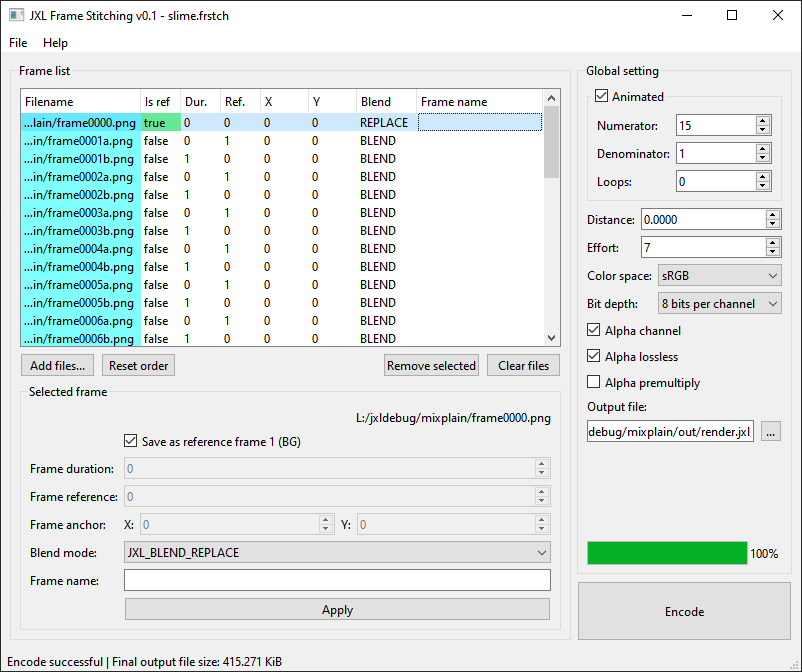

# JXL Frame Stitching
### Join multiple images into a single JPEG XL image as multilayered or animated, using libjxl's API.

Written in C++ with Qt 6.5.3

## Features
- Image loading is handled with QImage, will accept anything that QImage can load
- Animated inputs (eg. GIF) will be encoded as animation as well (as long as the project is set to the same framerate), therefore stitching multiple animation is possible
- Input images can have different dimensions aka. crops, and out-of-bounds pixels will be retained
- Can encode to 8, 16, float 16, and float 32 bit per channel, with or without alpha channel
- Multiple colorspace support, can also retain ICC profile that's taken from the first frame
- Image frame ordering:
  - Animated: first image = first frame; last image = last frame
  - Multilayered: first image = bottom layer; last image = top layer

### Current limitations:
- Cannot insert JXL image as input, not implemented decoding yet ***(soon-ish!)***
- Only RGB color model

### Where to view the results?
For animated JXL, IrvanView and supported browsers (eg. Safari 17.0+, Waterfox, Thorium) should open them just fine.
As for multilayered JXL, AFAIK only Krita that can properly open them with layers intact,
other viewers and editors still coalesce the layers into a single layer. However, Krita won't be able to fully decode
multilayered animated JXL (individual images per frame will be imported as coalesced).

### To build:
- Need cmake, meson, and ninja for build tools
- Build 3rdparty dependencies first
- Configure and build main project
